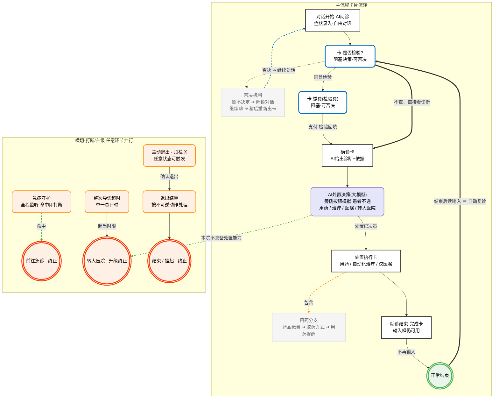

### 一、 核心业务逻辑解析 (Markdown 结构化)

**1. 主流程 (Main Flow)**

- **对话开始·AI问诊**：患者录入症状，与AI进行自由对话。
- **卡：是否检验？**（阻塞决策，可否决）：AI判断是否需要医学检验。
  - *同意检验* -> 进入缴费。
  - *不查* -> 直接跳至“确诊卡”。
  - *否决机制* -> 暂不决定，解锁对话继续聊，稍后重新给出此卡。
- **卡：缴费(检验费)**（阻塞决策，可否决）：支付费用，检验结果回填后继续。
- **确诊卡**：AI 结合问诊和检验结果给出诊断及依据。
- **AI 处置决策(大模型)**：后台大模型决定后续方案（用药/治疗/医嘱/转大医院）。
- **处置执行卡**：根据决策执行对应分支（如：用药分支包含药品缴费、取药方式、用药提醒）。
- **就诊结束·完成卡**：流程走完，但底部输入框依然可用。
  - *不再输入* -> 正常结束。
  - *结束后续输入* -> 触发自动复诊，跳回“是否检验？”环节。

**2. 横切·打断/升级机制 (全局并行)** 这些动作可以在上述主流程的**任意环节**触发：

- **急症守护**：全程监听患者对话，一旦命中急症关键词，立即打断，引导**前往急诊（终止）**。
- **整次导诊超时**：单一总计时的超时限制，一旦超时，或大模型判断“本院不具备”处置条件，则**转大医院（升级终止）**。
- **主动退出**：点击顶栏X触发，确认退出后进行“退出结算”（不可逆），最终**结束/挂起（终止）**。

