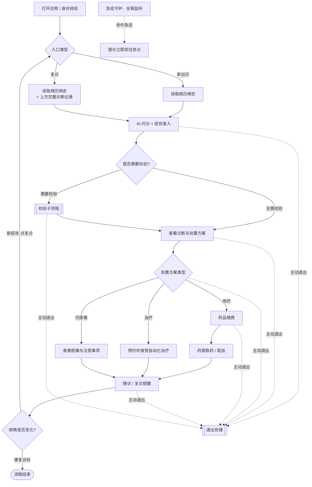
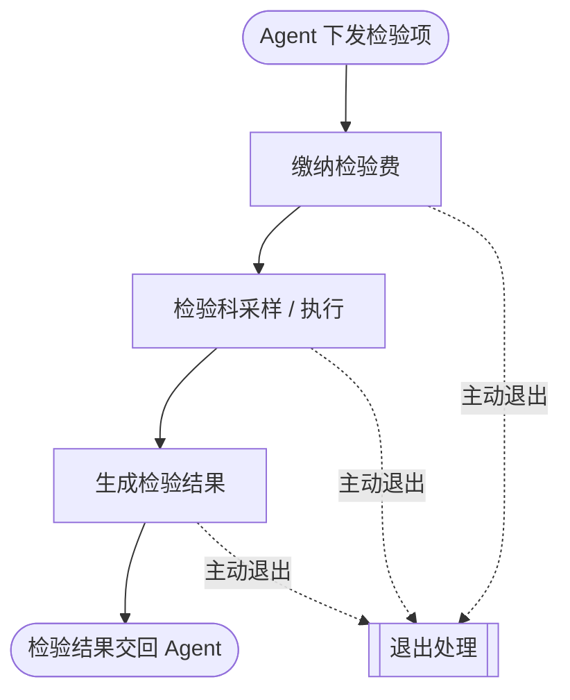
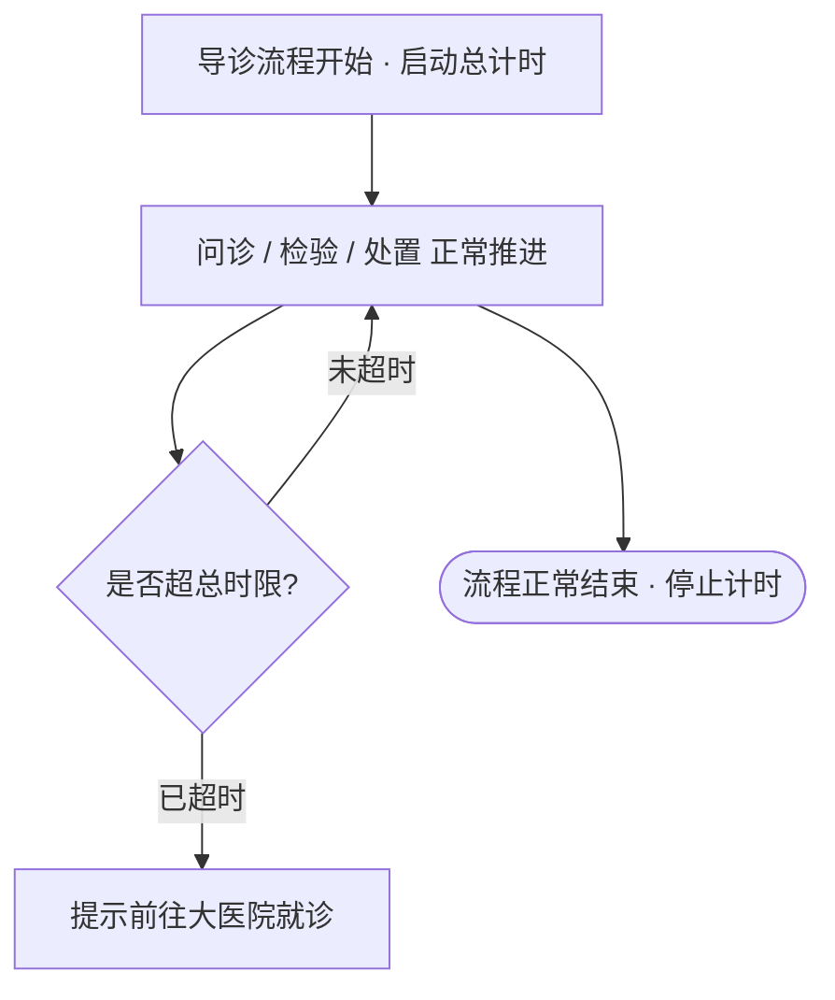
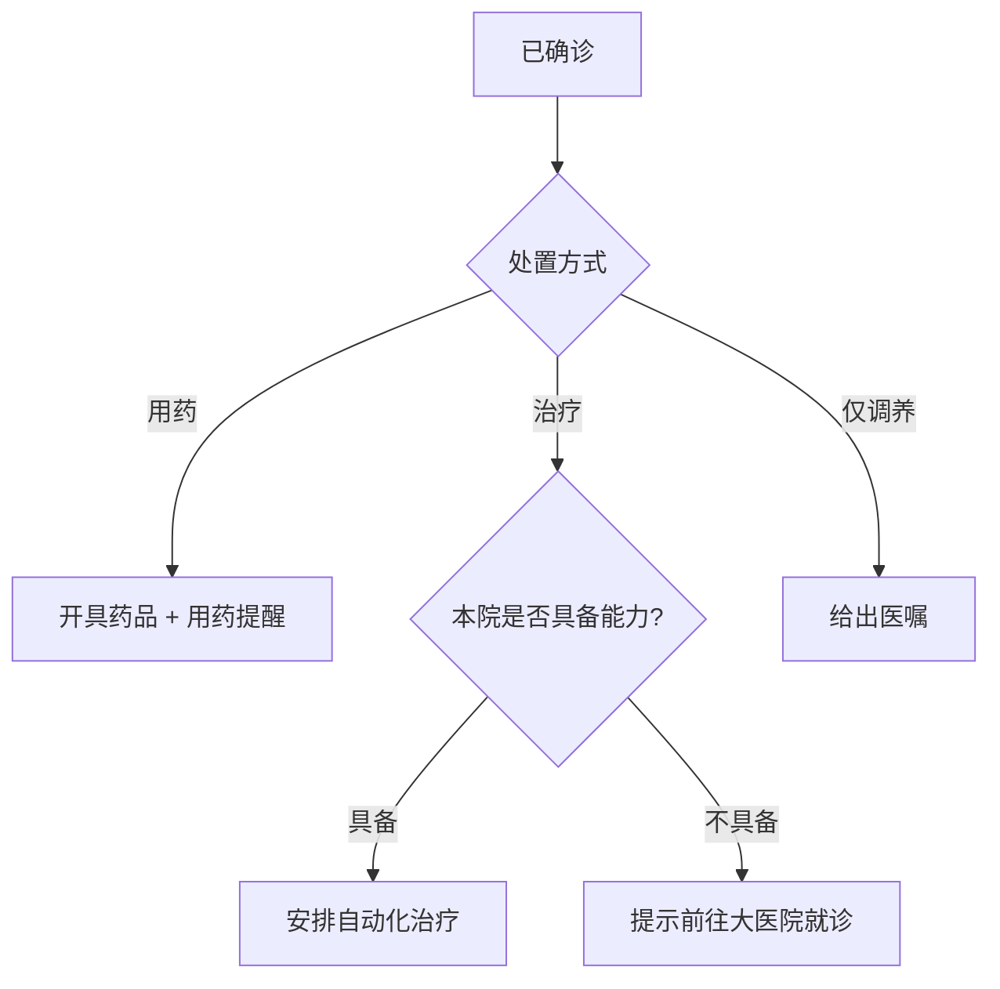
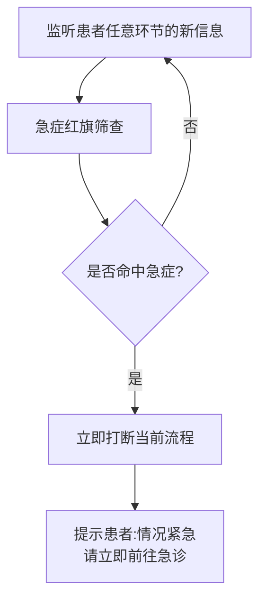
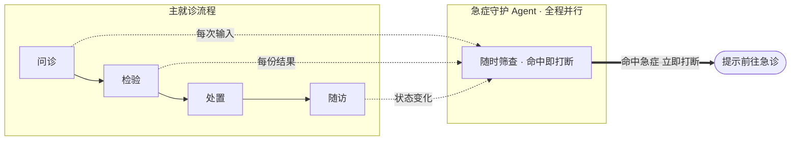
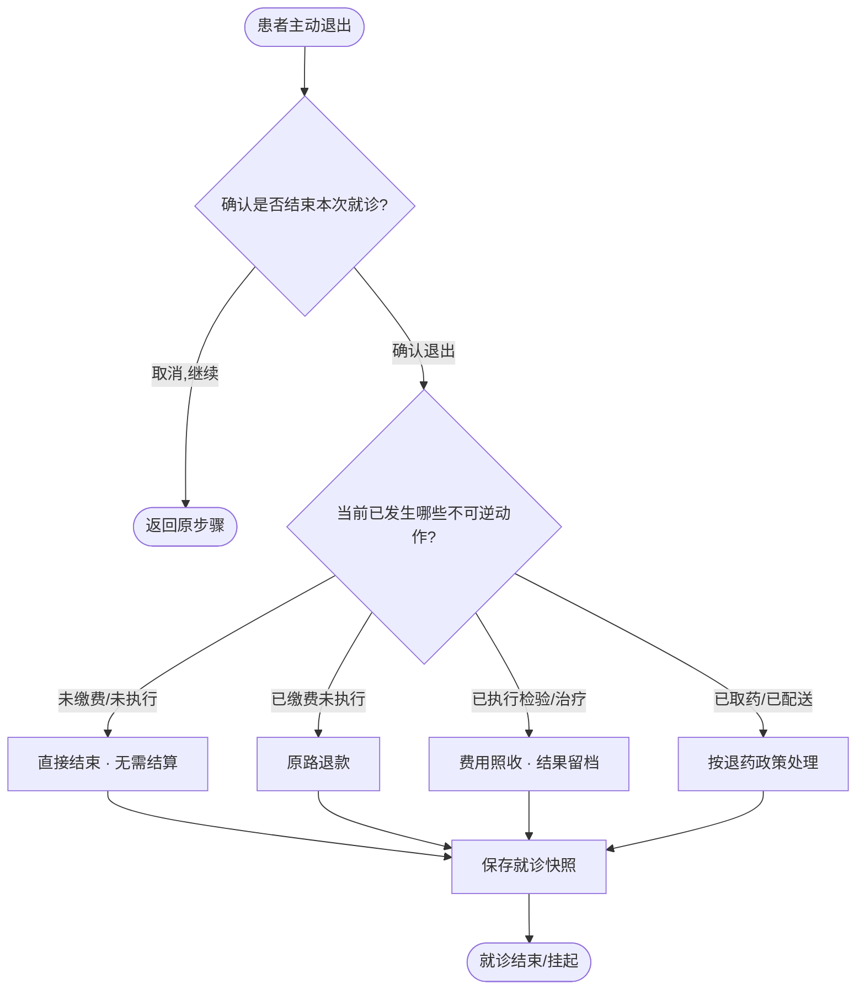
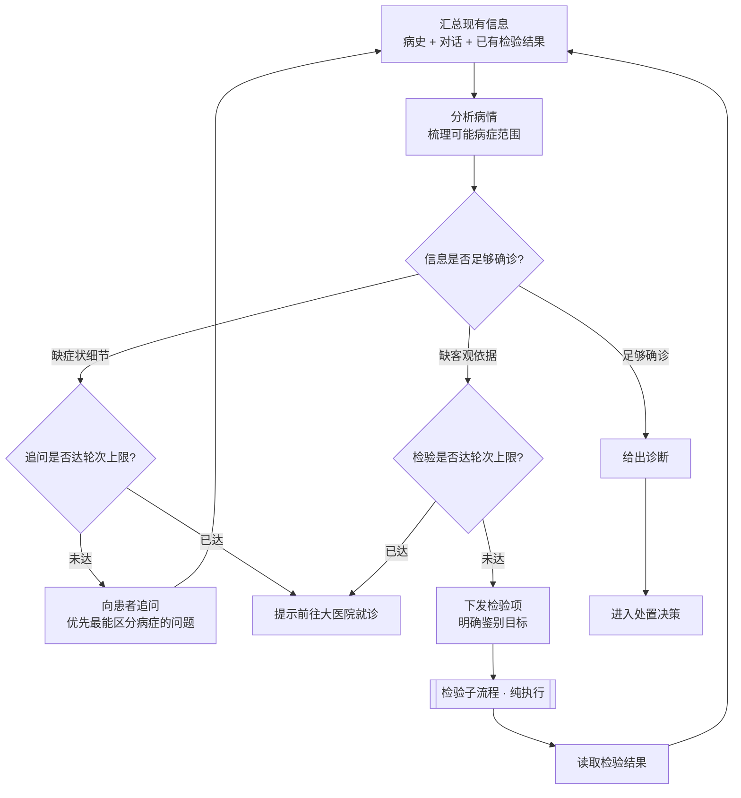

# 无人医院·患者端流程设计

## 一、主流程

急症判断独立成线(不占主链路菱形);患者主动退出任意步骤可触发,引向统一退出处理。复诊与新出诊在入口处区分读取的资料。

---

## 二、检验子流程

---

## 三、整次导诊的单一超时计数

全流程只有这一处超时,作用于"一次完整导诊"整体,而非每个步骤各自计时。

---

## 四、处置决策

---

## 五、急症守护 Agent

独立并行,全程监听患者每一次新信息(每轮对话/体征/检验结果),命中即刻打断任何流程。命中后动作简化为单一提示前往急诊,不含系统侧急救/转运编排。

与主流程的关系(罩在其上,而非串在其中):

> 急症判断**每次新信息都重新筛查**,而非开头判一次——患者可能在多轮问诊、检验后甚至随访中才暴露危急信号。

---

## 六、患者主动退出 · 退出处理

> 退出后果由"已发生的不可逆动作"决定,而非由停在第几步决定。

---

## 二、Agent 决策主循环

主流程里的「问诊→是否需要检验→确诊」本质是同一套推理在反复运转:每次汇总最新信息(含新追问的回答、新返回的检验结果)判断是否足够确诊,不够则补、够则确诊转处置。追问与检验各设轮次上限,达上限统一提示前往大医院。急症由独立守护并行处理,不在本循环内。

